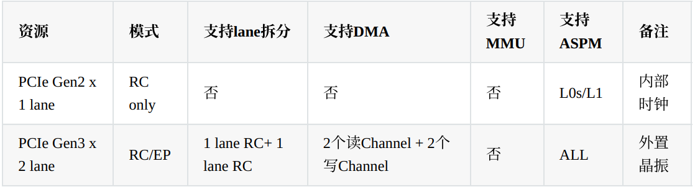

调试rk3568pcie3 M2 SSD

```

```

由原理图得pcie gen3x2 lane 可拆分




```
pcie3x2控制通道0

相关引脚为：
GPIO1_A4_D PCIN_PWR_EN_GPIO1_A4
GPIO2_D3_D PCIE30X1_WAKEN_M1
GPIO2_D2_D PCIE30X1_CLKREQN_M1
GPIO3_A1_D PCIE30X1_PERSTN_M1

&pcie30phy {
	status = "okay";
	rockchip,pipe-grf = <&pipegrf>; 
	//rockchip,phy-mode = <4>;
	//rockchip,pipe-grf = <&pipe_phy_grf2>;
	//rockchip,grf = <&grf>;
};

&pcie3x2 {
	//num-lanes = <1>;
	//rockchip,bifurcation;
	//supports-clkreq;
	reset-gpios = <&gpio3 RK_PA1 GPIO_ACTIVE_HIGH>;
	wake-gpios = <&gpio2 RK_PD3 GPIO_ACTIVE_LOW>;       // WAKEN
    clkreq-gpios = <&gpio2 RK_PD2 GPIO_ACTIVE_LOW>;     // CLKREQN
	vpcie3v3-supply = <&vcc3v3_pcie>;
	status = "okay";

	pinctrl-names = "default";
	pinctrl-0 = <&pcie30x1m1_pins>;
};
```


```
cat /sys/firmware/devicetree/base/pcie@fe280000/status
okay


```


###### 验证pcie3 m2 ssd

```
root@rk3568-buildroot:/# lspci
21:00.0 Class 0108: 15b7:5019
20:00.0 Class 0604: 1d87:3566
	20:00.0 是 RK3568 自身的 PCIe 根端口（Root Port）。
	21:00.0 是连接在总线上的设备。Class 0108 代表 "Non-Volatile memory controller"，这是 NVMe SSD。15b7:5019 是厂商和设备ID。
	
#成功日志		注意：硬件连接，Pcie链路，设备识别，驱动加载
root@rk3568-buildroot:/# dmesg | grep -i "pci\|nvme"
[    1.761953] PCI/MSI: /interrupt-controller@fd400000/interrupt-controller@fd440000 domain created
[    1.960927] pcie30_avdd0v9: supplied by vcc3v3_sys
[    1.961228] pcie30_avdd1v8: supplied by vcc3v3_sys
[    1.961568] vcc3v3_pcie: supplied by dc_12v
[    2.543646] PCI: CLS 0 bytes, default 64
[    2.617728] rk-pcie 3c0800000.pcie: invalid prsnt-gpios property in node
[    2.627131] snps pcie3phy FW update! size 8192
[    2.641470] rk-pcie 3c0800000.pcie: IRQ msi not found
[    2.641497] rk-pcie 3c0800000.pcie: use outband MSI support
[    2.641509] rk-pcie 3c0800000.pcie: Missing *config* reg space
[    2.641531] rk-pcie 3c0800000.pcie: host bridge /pcie@fe280000 ranges:
[    2.641564] rk-pcie 3c0800000.pcie:      err 0x00f0000000..0x00f00fffff -> 0x00f0000000
[    2.641588] rk-pcie 3c0800000.pcie:       IO 0x00f0100000..0x00f01fffff -> 0x00f0100000
[    2.641620] rk-pcie 3c0800000.pcie:      MEM 0x00f0200000..0x00f1ffffff -> 0x00f0200000
[    2.641642] rk-pcie 3c0800000.pcie:      MEM 0x0380000000..0x03bfffffff -> 0x0380000000
[    2.641695] rk-pcie 3c0800000.pcie: Missing *config* reg space
[    2.641740] rk-pcie 3c0800000.pcie: invalid resource
[    2.904553] rk-pcie 3c0800000.pcie: PCIe Link up, LTSSM is 0x230011
[    2.904730] rk-pcie 3c0800000.pcie: PCI host bridge to bus 0002:20
[    2.904748] pci_bus 0002:20: root bus resource [bus 20-2f]
[    2.904761] pci_bus 0002:20: root bus resource [??? 0xf0000000-0xf00fffff flags 0x0]
[    2.904774] pci_bus 0002:20: root bus resource [io  0x0000-0xfffff] (bus address [0xf0100000-0xf01fffff])
[    2.904784] pci_bus 0002:20: root bus resource [mem 0xf0200000-0xf1ffffff]
[    2.904794] pci_bus 0002:20: root bus resource [mem 0x380000000-0x3bfffffff pref]
[    2.904836] pci 0002:20:00.0: [1d87:3566] type 01 class 0x060400
[    2.904866] pci 0002:20:00.0: reg 0x38: [mem 0x00000000-0x0000ffff pref]
[    2.904930] pci 0002:20:00.0: supports D1 D2
[    2.904942] pci 0002:20:00.0: PME# supported from D0 D1 D3hot
[    2.915812] pci 0002:20:00.0: Primary bus is hard wired to 0
[    2.915867] pci 0002:20:00.0: bridge configuration invalid ([bus 01-ff]), reconfiguring
[    2.916131] pci 0002:21:00.0: [15b7:5019] type 00 class 0x010802
[    2.916223] pci 0002:21:00.0: reg 0x10: [mem 0x00000000-0x00003fff 64bit]
[    2.916316] pci 0002:21:00.0: reg 0x20: [mem 0x00000000-0x000000ff 64bit]
[    2.916736] pci 0002:21:00.0: 7.876 Gb/s available PCIe bandwidth, limited by 8.0 GT/s PCIe x1 link at 0002:20:00.0 (capable of 31.504 Gb/s with 8.0 GT/s PCIe x4 link)
[    2.935294] pci_bus 0002:21: busn_res: [bus 21-2f] end is updated to 21
[    2.935375] pci 0002:20:00.0: BAR 8: assigned [mem 0xf0200000-0xf02fffff]
[    2.935394] pci 0002:20:00.0: BAR 6: assigned [mem 0xf0300000-0xf030ffff pref]
[    2.935412] pci 0002:21:00.0: BAR 0: assigned [mem 0xf0200000-0xf0203fff 64bit]
[    2.935460] pci 0002:21:00.0: BAR 4: assigned [mem 0xf0204000-0xf02040ff 64bit]
[    2.935502] pci 0002:20:00.0: PCI bridge to [bus 21]
[    2.935515] pci 0002:20:00.0:   bridge window [mem 0xf0200000-0xf02fffff]
[    2.938341] pcieport 0002:20:00.0: PME: Signaling with IRQ 102
[    2.938831] nvme nvme0: pci function 0002:21:00.0
[    2.938932] nvme 0002:21:00.0: enabling device (0000 -> 0002)
[    2.948125] nvme nvme0: allocated 32 MiB host memory buffer.
[    2.951019] nvme nvme0: 4/0/0 default/read/poll queues
[    2.969661] ehci-pci: EHCI PCI platform driver
[    3.375549] cpu cpu0: pvtm = 91220, from nvmem
[    3.822040] mpp_rkvenc fdf40000.rkvenc: pvtm = 91220, from nvmem
[    3.825003] mpp_rkvdec2 fdf80200.rkvdec: pvtm = 91220, from nvmem
[    3.828062] rockchip-dmc dmc: pvtm = 91220, from nvmem
[    3.828122] mali fde60000.gpu: pvtm = 91220, from nvmem
[    3.930906] RKNPU fde40000.npu: pvtm = 91220, from nvmem

	#rk-pcie 3c0800000.pcie: PCIe Link up, LTSSM is 0x230011	表明 PCIe 链路训练成功，物理连接已建立。
	#pci 0002:21:00.0: [15b7:5019] type 00 class 0x010802		内核成功扫描到了 NVMe 设备。
	#nvme nvme0: pci function 0002:21:00.0		 NVMe 驱动已经识别并绑定了这个 PCIe 设备，创建了 nvme0 内核对象。
	#nvme nvme0: allocated 32 MiB host memory buffer. 和 nvme nvme0: 4/0/0 default/read/poll queues			NVMe 驱动初始化成功，为设备分配了资源并建立了I/O队列。
	
	
root@rk3568-buildroot:/# ls -l /dev/nvme*
crw------- 1 root root 239, 0 Aug  4 09:19 /dev/nvme0
brw-rw---- 1 root disk 259, 0 Aug  4 09:19 /dev/nvme0n1
	#/dev/nvme0 是控制器本身
	#/dev/nvme0n1 是 SSD 上的命名空间 1，通常这就是你要用的块设备。

root@rk3568-buildroot:/# fdisk -l /dev/nvme0n1
Disk /dev/nvme0n1: 466 GB, 500107862016 bytes, 976773168 sectors
476940 cylinders, 64 heads, 32 sectors/track
Units: sectors of 1 * 512 = 512 bytes

Disk /dev/nvme0n1 doesn't contain a valid partition table
	#设备路径	/dev/nvme0n1
	#状态： 不包含有效的分区表（这是正常的，因为是全新的 SSD）
	###		需要对SSD进行分区和格式化才能使用
```


###### SSD的使用

```
ls -l /dev/nvme*
#分区方法1
parted /dev/nvme0n1
mklabel gpt           # 创建GPT分区表
mkpart primary 0% 100% # 创建单个分区占用整个磁盘
print                 # 验证分区信息
quit                  # 退出
#分区方法2
fdisk /dev/nvme0n1
g     # 创建GPT分区表（新版fdisk）
n     # 创建新分区
      # 使用所有默认值（分区号、起始扇区、结束扇区）
w     # 写入并退出

#刷新分区表
partprobe /dev/nvme0n1 		或 	blockdev --rereadpt /dev/nvme0n1

# 确认分区节点创建
ls -l /dev/nvme*			# 应该看到 /dev/nvme0n1p1

#格式化分区
mkfs.ext4 /dev/nvme0n1p1	# 格式化为ext4文件系统

#临时挂载
mkdir -p /mnt/nvme_ssd					# 创建挂载点
mount /dev/nvme0n1p1 /mnt/nvme_ssd		# 挂载分区
df -h /mnt/nvme_ssd						# 验证挂载

#开机自动挂载
blkid /dev/nvme0n1p1		# 获取分区UUID
vi /etc/fstab				# 编辑fstab文件
	文件末尾添加	UUID=6d7d6603-1a95-4d23-a1ae-889d94c90c20 /mnt/nvme_ssd ext4 defaults 0 2
mount -a					# 测试配置
```


###### pcie3 m2 ssd测试

```
硬件连接后

#检查SSD是否被系统识别：
lspci | grep -i nvme
lspci
lsblk
fdisk -l
lspci -mk		#查看所有pcie设备信息
dmesg | grep -i nvme

#提示：为了结果准确，测试文件要远大于系统可用内存，避免操作系统缓存带来的性能虚高
#无需挂载就可以测试，直接测试物理磁盘性能，挂载后会受到文件系统类型影响，ext4、NTFS等

--size=1G：测试文件大小 1GB
--bs=1M/4k：块大小，顺序测试用 1MB，随机测试用 4KB
--direct=1：重要！绕过缓存，获得真实磁盘性能
--iodepth=1/16/32：队列深度，影响并发性能
--runtime=60：测试运行 60 秒
--time_based：按时间运行而不是按数据量
--group_reporting：合并报告所有 job 的结果

root@rk3568-buildroot:/# fio --name=seq_read --filename=/dev/nvme0n1p1 --rw=read --size=1G --bs=1M --direct=1 --iodepth=1 --runtime=30 --time_based --group_reporting
seq_read: (g=0): rw=read, bs=(R) 1024KiB-1024KiB, (W) 1024KiB-1024KiB, (T) 1024KiB-1024KiB, ioengine=psync, iodepth=1
fio-3.28
Starting 1 process
Jobs: 1 (f=1): [R(1)][100.0%][r=632MiB/s][r=632 IOPS][eta 00m:00s]
seq_read: (groupid=0, jobs=1): err= 0: pid=2587: Fri Aug  4 09:09:12 2017
  read: IOPS=631, BW=632MiB/s (663MB/s)(18.5GiB/30002msec)
    clat (usec): min=1528, max=3399, avg=1571.43, stdev=42.57
     lat (usec): min=1529, max=3404, avg=1572.51, stdev=42.74
    clat percentiles (usec):
     |  1.00th=[ 1532],  5.00th=[ 1532], 10.00th=[ 1532], 20.00th=[ 1532],
     | 30.00th=[ 1532], 40.00th=[ 1549], 50.00th=[ 1549], 60.00th=[ 1598],
     | 70.00th=[ 1598], 80.00th=[ 1598], 90.00th=[ 1614], 95.00th=[ 1614],
     | 99.00th=[ 1696], 99.50th=[ 1762], 99.90th=[ 1876], 99.95th=[ 1926],
     | 99.99th=[ 2073]
   bw (  KiB/s): min=619305, max=656095, per=100.00%, avg=647337.97, stdev=6059.89, samples=59
   iops        : min=  604, max=  640, avg=631.59, stdev= 5.90, samples=59
  lat (msec)   : 2=99.99%, 4=0.01%
  cpu          : usr=1.15%, sys=18.73%, ctx=18987, majf=0, minf=275
  IO depths    : 1=100.0%, 2=0.0%, 4=0.0%, 8=0.0%, 16=0.0%, 32=0.0%, >=64=0.0%
     submit    : 0=0.0%, 4=100.0%, 8=0.0%, 16=0.0%, 32=0.0%, 64=0.0%, >=64=0.0%
     complete  : 0=0.0%, 4=100.0%, 8=0.0%, 16=0.0%, 32=0.0%, 64=0.0%, >=64=0.0%
     issued rwts: total=18956,0,0,0 short=0,0,0,0 dropped=0,0,0,0
     latency   : target=0, window=0, percentile=100.00%, depth=1

Run status group 0 (all jobs):
   READ: bw=632MiB/s (663MB/s), 632MiB/s-632MiB/s (663MB/s-663MB/s), io=18.5GiB (19.9GB), run=30002-30002msec

Disk stats (read/write):
  nvme0n1: ios=37774/0, merge=0/0, ticks=40539/0, in_queue=40539, util=99.91%


root@rk3568-buildroot:/# fio --name=seq_write --filename=/dev/nvme0n1p1 --rw=write --size=1G --bs=1M --direct=1 --iodepth=1 --runtime=30 --time_based --group_reporting
seq_write: (g=0): rw=write, bs=(R) 1024KiB-1024KiB, (W) 1024KiB-1024KiB, (T) 1024KiB-1024KiB, ioengine=psync, iodepth=1
fio-3.28
Starting 1 process
Jobs: 1 (f=1): [W(1)][100.0%][w=533MiB/s][w=533 IOPS][eta 00m:00s]
seq_write: (groupid=0, jobs=1): err= 0: pid=2713: Fri Aug  4 09:09:54 2017
  write: IOPS=508, BW=508MiB/s (533MB/s)(14.9GiB/30002msec); 0 zone resets
    clat (usec): min=1525, max=28434, avg=1691.30, stdev=668.85
     lat (usec): min=1631, max=28585, avg=1946.84, stdev=671.67
    clat percentiles (usec):
     |  1.00th=[ 1532],  5.00th=[ 1549], 10.00th=[ 1565], 20.00th=[ 1582],
     | 30.00th=[ 1598], 40.00th=[ 1614], 50.00th=[ 1631], 60.00th=[ 1647],
     | 70.00th=[ 1663], 80.00th=[ 1680], 90.00th=[ 1680], 95.00th=[ 1713],
     | 99.00th=[ 6259], 99.50th=[ 6456], 99.90th=[ 7439], 99.95th=[12780],
     | 99.99th=[27657]
   bw (  KiB/s): min=464896, max=550912, per=100.00%, avg=521037.58, stdev=15431.71, samples=59
   iops        : min=  454, max=  538, avg=508.75, stdev=14.97, samples=59
  lat (msec)   : 2=98.16%, 4=0.79%, 10=0.98%, 20=0.04%, 50=0.03%
  cpu          : usr=14.00%, sys=14.07%, ctx=15287, majf=0, minf=19
  IO depths    : 1=100.0%, 2=0.0%, 4=0.0%, 8=0.0%, 16=0.0%, 32=0.0%, >=64=0.0%
     submit    : 0=0.0%, 4=100.0%, 8=0.0%, 16=0.0%, 32=0.0%, 64=0.0%, >=64=0.0%
     complete  : 0=0.0%, 4=100.0%, 8=0.0%, 16=0.0%, 32=0.0%, 64=0.0%, >=64=0.0%
     issued rwts: total=0,15256,0,0 short=0,0,0,0 dropped=0,0,0,0
     latency   : target=0, window=0, percentile=100.00%, depth=1

Run status group 0 (all jobs):
  WRITE: bw=508MiB/s (533MB/s), 508MiB/s-508MiB/s (533MB/s-533MB/s), io=14.9GiB (16.0GB), run=30002-30002msec

Disk stats (read/write):
  nvme0n1: ios=30/30392, merge=0/0, ticks=5/35778, in_queue=35783, util=99.92%
 
 
 
root@rk3568-buildroot:/# fio --name=rand_read --filename=/dev/nvme0n1p1 --rw=randread --size=1G --bs=4k --direct=1 --iodepth=32 --runtime=30 --time_based --group_reporting
rand_read: (g=0): rw=randread, bs=(R) 4096B-4096B, (W) 4096B-4096B, (T) 4096B-4096B, ioengine=psync, iodepth=32
fio-3.28
Starting 1 process
Jobs: 1 (f=1): [r(1)][100.0%][r=34.2MiB/s][r=8742 IOPS][eta 00m:00s]
rand_read: (groupid=0, jobs=1): err= 0: pid=2806: Fri Aug  4 09:10:48 2017
  read: IOPS=8678, BW=33.9MiB/s (35.5MB/s)(1017MiB/30001msec)
    clat (usec): min=66, max=759, avg=105.25, stdev= 7.73
     lat (usec): min=67, max=760, avg=106.18, stdev= 7.75
    clat percentiles (usec):
     |  1.00th=[  103],  5.00th=[  103], 10.00th=[  103], 20.00th=[  104],
     | 30.00th=[  104], 40.00th=[  104], 50.00th=[  104], 60.00th=[  104],
     | 70.00th=[  105], 80.00th=[  105], 90.00th=[  106], 95.00th=[  114],
     | 99.00th=[  125], 99.50th=[  135], 99.90th=[  190], 99.95th=[  208],
     | 99.99th=[  351]
   bw (  KiB/s): min=33944, max=34954, per=100.00%, avg=34729.31, stdev=198.88, samples=59
   iops        : min= 8486, max= 8738, avg=8682.24, stdev=49.71, samples=59
  lat (usec)   : 100=0.26%, 250=99.72%, 500=0.02%, 750=0.01%, 1000=0.01%
  cpu          : usr=15.03%, sys=20.76%, ctx=260408, majf=0, minf=20
  IO depths    : 1=100.0%, 2=0.0%, 4=0.0%, 8=0.0%, 16=0.0%, 32=0.0%, >=64=0.0%
     submit    : 0=0.0%, 4=100.0%, 8=0.0%, 16=0.0%, 32=0.0%, 64=0.0%, >=64=0.0%
     complete  : 0=0.0%, 4=100.0%, 8=0.0%, 16=0.0%, 32=0.0%, 64=0.0%, >=64=0.0%
     issued rwts: total=260371,0,0,0 short=0,0,0,0 dropped=0,0,0,0
     latency   : target=0, window=0, percentile=100.00%, depth=32

Run status group 0 (all jobs):
   READ: bw=33.9MiB/s (35.5MB/s), 33.9MiB/s-33.9MiB/s (35.5MB/s-35.5MB/s), io=1017MiB (1066MB), run=30001-30001msec

Disk stats (read/write):
  nvme0n1: ios=259386/0, merge=0/0, ticks=21410/0, in_queue=21411, util=99.94%
 
 
 
root@rk3568-buildroot:/# fio --name=rand_write --filename=/dev/nvme0n1p1 --rw=randwrite --size=1G --bs=4k --direct=1 --iodepth=32 --runtime=30 --time_based --group_reporting
rand_write: (g=0): rw=randwrite, bs=(R) 4096B-4096B, (W) 4096B-4096B, (T) 4096B-4096B, ioengine=psync, iodepth=32
fio-3.28
Starting 1 process
Jobs: 1 (f=1): [w(1)][100.0%][w=48.3MiB/s][w=12.4k IOPS][eta 00m:00s]
rand_write: (groupid=0, jobs=1): err= 0: pid=2872: Fri Aug  4 09:11:21 2017
  write: IOPS=12.4k, BW=48.4MiB/s (50.7MB/s)(1451MiB/30001msec); 0 zone resets
    clat (usec): min=64, max=1394, avg=69.97, stdev= 6.96
     lat (usec): min=65, max=1395, avg=71.25, stdev= 7.00
    clat percentiles (usec):
     |  1.00th=[   68],  5.00th=[   69], 10.00th=[   69], 20.00th=[   69],
     | 30.00th=[   69], 40.00th=[   70], 50.00th=[   70], 60.00th=[   70],
     | 70.00th=[   70], 80.00th=[   71], 90.00th=[   71], 95.00th=[   73],
     | 99.00th=[   91], 99.50th=[   96], 99.90th=[  151], 99.95th=[  167],
     | 99.99th=[  285]
   bw (  KiB/s): min=48248, max=49920, per=100.00%, avg=49585.22, stdev=354.19, samples=59
   iops        : min=12062, max=12480, avg=12396.31, stdev=88.55, samples=59
  lat (usec)   : 100=99.61%, 250=0.38%, 500=0.01%, 750=0.01%
  lat (msec)   : 2=0.01%
  cpu          : usr=15.58%, sys=39.94%, ctx=371627, majf=0, minf=18
  IO depths    : 1=100.0%, 2=0.0%, 4=0.0%, 8=0.0%, 16=0.0%, 32=0.0%, >=64=0.0%
     submit    : 0=0.0%, 4=100.0%, 8=0.0%, 16=0.0%, 32=0.0%, 64=0.0%, >=64=0.0%
     complete  : 0=0.0%, 4=100.0%, 8=0.0%, 16=0.0%, 32=0.0%, 64=0.0%, >=64=0.0%
     issued rwts: total=0,371576,0,0 short=0,0,0,0 dropped=0,0,0,0
     latency   : target=0, window=0, percentile=100.00%, depth=32

Run status group 0 (all jobs):
  WRITE: bw=48.4MiB/s (50.7MB/s), 48.4MiB/s-48.4MiB/s (50.7MB/s-50.7MB/s), io=1451MiB (1522MB), run=30001-30001msec

Disk stats (read/write):
  nvme0n1: ios=30/370222, merge=0/0, ticks=6/16422, in_queue=16428, util=99.98%

#性能测试结果总结
测试类型	速度	IOPS	延迟	评价
顺序读取	632 MB/s	632 IOPS	1.57ms	优秀
顺序写入	508 MB/s	508 IOPS	1.69ms	优秀
4K随机读取	33.9 MB/s	8,678 IOPS	105μs	良好
4K随机写入	48.4 MB/s	12,400 IOPS	70μs	优秀

#理论速度上限：
PCIe3.0 x1理论带宽：8GT/s*(1 Lane/8 bits per GT) ≈ 1 GB/s (约985MB/s)
实际：扣除编码损耗等，实际持续读写速度通常在 800-900 MB/s 左右（理想）
CPU和总线瓶颈，速度无法达到峰值，正常500~700

#4K性能 vs 顺序性能
4k：操作系统级匹配，内存页大小4k，wxt4等文件系统默认块大小4k，现代硬盘/SSD 的物理扇区大小多为 4KB
	应用程序行为，加载DLL、so库文件通常是多个4k块，Word、Excel 保存时的小文件操作，加载 CSS、JS、小图片文件，索引查找、小记录读写
顺序速度：决定"大文件拷贝"快慢
4K随机速度：决定"系统响应"快慢
两者都表现良好，4K性能尤其重要

```


```
root@rk3568-buildroot:/# fdisk -l
Found valid GPT with protective MBR; using GPT

Disk /dev/nvme0n1: 976773168 sectors, 1804M
Logical sector size: 512
Disk identifier (GUID): ac486816-b383-49c7-ab84-3a88319e7957
Partition table holds up to 128 entries
First usable sector is 34, last usable sector is 976773134

Number  Start (sector)    End (sector)  Size Name
     1            2048       976773119  465G primary
Found valid GPT with protective MBR; using GPT
······


root@rk3568-buildroot:/# lspci -mk
21:00.0 "Class 0108" "15b7" "5019" "15b7" "5019" "nvme"
20:00.0 "Class 0604" "1d87" "3566" "0000" "0000" "pcieport"
01:00.0 "Class 0280" "14e4" "449d" "14e4" "aae8" "pcieh"
00:00.0 "Class 0604" "1d87" "3566" "0000" "0000" "pcieport"

root@rk3568-buildroot:/# which fio
/usr/bin/fio


root@rk3568-buildroot:/# cat /sys/class/nvme/nvme0/device/current_link_speed
class/nvme/nvme0/device/current_link_width8.0 GT/s PCIe
root@rk3568-buildroot:/# cat /sys/class/nvme/nvme0/device/current_link_width
1
#PCIe 链路速度: 8.0 GT/s PCIe
#PCIe 链路宽度: 1 (x1)
```


